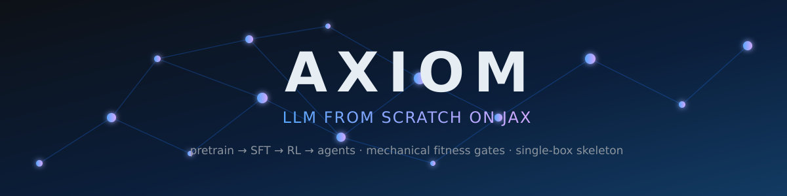

<div align="center">
  

  [](docs/RESULTS-GB10-2026-09-29.ru.md)
  [](evidence/a5-drift-report-20260929.json)
  [](net/tests/)
  [](docs/datasets/axiom-domain-ds-v1-card.md)
  [](https://github.com/jax-ml/jax)
  [](https://www.python.org/)
  [](LICENSE)
  [](https://romannekrasovaillm.github.io/axiom/)

  **RU:** собственная нейросеть с нуля на JAX — претрейн, SFT, RL, агентные способности и свой
  конвейер обучения. Не адаптация чужих весов. Скелет **L3** (~1B MoE / 20B токенов) обучается
  целиком на одной машине (NVIDIA GB10 / DGX Spark). Каждое решение зафиксировано ADR и проверяется
  механическими fitness-правилами (`CONSTRAINTS.yaml`) — без LLM-судей.
</div>

## ✨ Why this is interesting

- **Built from scratch, verified mechanically.** Hybrid **KDA** linear attention + **MLA** + **LatentMoE** + **MTP-1**, BF16 pretrain, Muon/Newton–Schulz — and every architectural claim is pinned by a behavioural fitness rule, not prose.
- **A dishonest green gate is worse than an honest red one.** The A4 run manifest carries the *composition* of pipeline stages and a *computed* `pipeline_complete` — a partial run cannot close the gate, forge hashes are rejected by construction.
- **The full pipeline, proven end-to-end on a single box** (≈$200 of compute): checkpoint → inference → RL environment → SFT → RL, with 374 acceptance tests, deterministic XLA profiling and run manifests with sha256 pinning.
- **Live architecture-as-code**: interactive [Archify diagrams](https://romannekrasovaillm.github.io/axiom/) rendered from a typed JSON IR — pipeline status and the data map update with every push.
- **A curated domain dataset**: verified agent episodes (mechanical verdicts, fail-closed), 101k records of concepts/distillates/skills from a private library — scrubbed, deduplicated, carded.

## 📊 Live reports (GitHub Pages)

- [Pipeline A4: 5/5 stages executed on GB10 — gate CLOSED](https://romannekrasovaillm.github.io/axiom/diagrams/a4-gate-flow.html) — interactive Archify diagram
- [Hardware run report (RU, 29.09)](https://romannekrasovaillm.github.io/axiom/RESULTS-GB10-2026-09-29.ru.html) — full pipeline on DGX Spark
- [Data map: pretrain (public) vs post-train (private)](https://romannekrasovaillm.github.io/axiom/diagrams/axiom-data-map.html)
- [Results report (RU)](https://romannekrasovaillm.github.io/axiom/RESULTS-2026-09-27.ru.html) · [Open questions & forks](https://romannekrasovaillm.github.io/axiom/OPEN-QUESTIONS.md)
- **[Contributing guide (RU)](docs/CONTRIBUTING.ru.md)** — how to join, where to help, acceptance rules

## What is here

- **`net/`** — the model, in JAX: hybrid **KDA** linear attention (DeltaNet-family with short
  conv + decay gates) + **MLA** layers + **AttnRes** + **LatentMoE** (latent 0.5×hidden,
  12 routed + 2 shared experts, top-2, aux-free QB monitoring) + **SiTU-GLU**, **MTP-1** head,
  minimal vision path (ViT). BF16 pretrain, Muon + Newton–Schulz (Polar Express) optimizer.
- **`env/`** — the RL environment: task generation, verifier, reward (binary, mechanical), net executor.
- **`tools/`** — training/eval harness: SFT/RL smoke runs, precision pinning checks, A4 pipeline,
  manifest and budget gates, **dataset pipelines** (`tools/prep_pretrain/`, `tools/axiom_ds/`).
- **`docs/adr/`** — architecture decision records (RU): scale class, JAX/MaxText stack (ADR-008),
  determinism & accuracy pinning, RL arena, post-training, **long-context mechanics (ADR-009/012/018),
  domain dataset (ADR-020), pretrain mix (ADR-021), compute stack (ADR-017)**.
- **`docs/specs/`** — model skeleton spec, environment spec, stage deltas.
- **`docs/research/`** — kernel/delta research notes from actual runs.
- **`docs/datasets/`** — dataset cards (machine-readable + human): composition, sha256, provenance.
- **`ARCHITECTURE-SPINE.md`** — the invariants (AD-1…AD-11): mechanical verdicts, single run contract,
  snapshot pinning, privacy, GB10 resource limits, cost ceiling, subject-matter guards.

Design decisions cite published reports and keep a fidelity matrix (`docs/FIDELITY-TO-K3.md`):
KDA/AttnRes/LatentMoE skeleton follows the published Kimi K3 design; router/bias/routed-scale
from DeepSeek-V3; Muon/Newton–Schulz precision and MTP self-speculative decoding from StepFun;
MoE routing pathologies, async CISPO recipe and eval-integrity practice from Poolside Laguna.
Our novelty lives in the data pipeline, post-training and the harness — not in re-deriving
published kernels.

## 🚀 Quickstart

```bash
# pure-python harness tests (no JAX needed)
python3 -m pytest tools/tests -q

# model tests need JAX (CPU is enough for most)
python3 -m pip install -r env/requirements.txt
python3 -m pytest net/tests -q
```

`venv` note: tests and smoke scripts expect a JAX-enabled interpreter (see `net/README.md` for
CUDA `LD_LIBRARY_PATH` details).

## 🧠 Сеть: каждый компонент и зачем он там

Живая диаграмма: [net-architecture.html](https://romannekrasovaillm.github.io/axiom/diagrams/net-architecture.html). Таблица — не справка ради справки: каждый пункт отвечает «почему не стандартное решение».

| Компонент | Где | Зачем именно это |
|---|---|---|
| BPE-160K токенизатор | `net/tokenizer.py` | Своя BPE с seed-пиннингом: воспроизводимость байт-в-байт. RT 100% — ни одного «примерно такого же» токена |
| **KDA ×18 слоёв** | `net/kda.py` | Линейное внимание (DeltaNet-семейство): delta rule + short conv + decay gates. O(N) вместо O(N²) — только поэтому 1M контекст вообще мыслим на одном боксе |
| **MLA ×6 слоёв** | `net/mla.py` | Gated multi-head latent attention со sparse-выбором top-k и block-merging. Плотный softmax на 1M токенах не влезает ни в какую память — выбор истории обязателен |
| AttnRes | `net/attnres.py` | Резидуальная стабилизация внимания: без неё глубокий стек из 24 слоёв сыплется на первых шагах |
| **LatentMoE 12+2** | `net/moe.py` | 12 маршрутизируемых + 2 общих эксперта, top-2: считаем ~30% параметров на токен. Latent-сжатие (0.5×hidden) — экономит память экспертов при том же качестве маршрута |
| SiTU-GLU | `net/mlp.py` | Активация FFN из базы K3 — верность опубликованному дизайну (AD-5) |
| NoPE | конфиг | Без позиционных кодировок: длина контекста перестаёт быть жёстким лимитом — экстраполяция вместо интерполяции |
| **MTP-1 head** | `net/mtp.py` | Предсказание следующего+1 токена: дешёвый self-speculative decoding — tok/s без второго прохода |
| ViT ~22M | `net/vit.py` | Минимальный визуальный путь: мультимодальность v1 (text+image+video) — заявлено владельцем |
| **QAT MXFP4** | `net/quant.py` | Квантизация включается со стадии SFT: инференс 1B-модели влезает в 16 ГБ consumer-карты |
| Muon + Newton–Schulz | `net/optimizer.py` | Per-head оптимизатор с Polar Express — своя точность матмулов, пиннится в приёмке (ADR-010) |
| Orbax + tree_hash | `net/checkpoint.py` | Чекпойнты с хешем дерева: манифест A4 пиннит веса (AD-4), resume без сюрпризов |
| RL-среда | `env/` | Задачи с механическим вердиктом: fitness-правила вместо LLM-судьи — reward не подкупить |

## ⚙️ Стек: JAX и почему не «очевидное»

Живая диаграмма: [jax-stack.html](https://romannekrasovaillm.github.io/axiom/diagrams/jax-stack.html).

Как это работает: наш код (`net/`, `env/`) выражается через **JAX API** (`jit/vmap/grad` — обучение есть композиция трансформаций) → **XLA** компилирует граф целиком, фьюзит операторы, держит детерминизм (флаг из ADR-013) → **Pallas** компилирует наши кастомные KDA-кернелы без строчки на C++ → CUDA-плагин исполняет на 4080/GB10/H800 одним и тем же кодом.

Почему JAX, а не «обычный» PyTorch:
- **детерминизм для A5** — повторный прогон обязан давать побитово тот же манифест, `--xla_gpu_deterministic_ops` делает это флагом;
- **Tunix** — GRPO/GSPO и MTP-рецепты K2-семейства уже написаны, свой RL-фреймворк = месяцы;
- **MaxText-форк** — шардирование для L1 (30B) без собственного параллелизма;
- **Pallas** — KDA-кернелы без отдельного CUDA-тулчейна.

Почему не Rust (ADR-017): порта JAX/XLA нет — проверено по первоисточникам 25.09; точечно Rust живёт на FFI-ops и инференсе, если Pallas упрётся в потолок.

## 📚 Данные для обучения: полный конвейер

Живая диаграмма: [axiom-data-map.html](https://romannekrasovaillm.github.io/axiom/diagrams/axiom-data-map.html).

**Фаза 1 — претрейн 20B токенов на аренде H800 (≈$200, только публичное, AD-6):**

| Шард | Что внутри | Что это даёт модели |
|---|---|---|
| **W ~17B** FineWeb-Edu | отфильтрованный образовательный веб | язык и общее знание |
| **C ~3B** The Stack v2-dedup | код python/rust/go/js/shell, permissive-лицензии | код и структурное мышление — под агентную ось |
| **Q ~1B** decay-фаза | сужённый качественный микс | последние токены обучения — самое качественное |

**Фаза 2 — доменная CPT-адаптация (GB10/4080, приватное, AD-6):**

| Компонент | Источник | Что это даёт |
|---|---|---|
| **K** 95k концептов | библиотека Ариадны (8 ML-типов, α/β/γ) | структурированное знание ML/архитектуры |
| **D** 5.5k дистиллятов | разборы статей и блогов | прозаические методики, связный контекст |
| **S** 263+ скилла | плагины контура (allowlist) | процедурные знания: как делается работа |

**Фаза 3 — SFT/RL (локально):**

| Компонент | Что внутри | Что это даёт |
|---|---|---|
| **E** verified-эпизоды | 1378 сессий агентов → эпизоды с механическим вердиктом | траектории «задача → действия → вердикт» с неокупаемым reward |
| RL-задачи | среда v1: fitness-гейты | негативный опыт учится через reward, не через текст |

## 🤝 How to help

Pick a fork from [`docs/OPEN-QUESTIONS.md`](docs/OPEN-QUESTIONS.md) — every item names the owner,
the options and what it unblocks:

- **Operator on GB10/DGX Spark** — run the smoke pipeline + `spark_inference` on the stand; closes the A4 gate (O-1).
- **Dataset curation** — review the 1 331 skills outside the domain allowlist (V-2); legacy corpus conversion (V-3).
- **Pretrain loop** — the streaming loader + resume path (V-4) before the 20B-token run (≈$200).
- **Long-context measurement** — 64K gap benchmarks for the block-wise token merging flag (D-4).
- **Docs & diagrams** — keep the live Pages and the fidelity matrix honest.

Rules of engagement: no weakening of fitness rules (anti-weakening, ADR-011), no fabricated
evidence (fail-closed everywhere), every decision as an ADR **before** implementation.

## Status

Skeleton L3 pretrain pipeline: walking skeleton complete (4/5 A4 stages executed with
mechanical evidence), staged training in progress. Scale class L1 (≈$44k) is an open decision
after skeleton results. Pretrain corpus W/C shards downloading; domain dataset v1 carded.

## License

MIT — see [LICENSE](LICENSE).

## Окружение (для кодовых агентов)

Python-окружение проекта: **`/home/roman/venv-axiom/bin/python`** (jax[cuda], tokenizers, pytest). Нестандартный путь — не ищи другие venv.

```bash
# тесты (CPU):
cd /home/roman/axiom && NET_JAX_BACKEND=cpu ~/venv-axiom/bin/python -m pytest net/tests tools/tests -q
# GB10 (ssh gb10-fast): ~/venv-axiom/bin/python там же; LD_LIBRARY_PATH=$(ls -d ~/venv-axiom/lib/python3.12/site-packages/nvidia/*/lib | tr '\n' ':')
```

Долгие прогоны: `setsid nohup ... < /dev/null > log 2>&1 &` (stdin обязательно `/dev/null`, иначе сессия висит).
